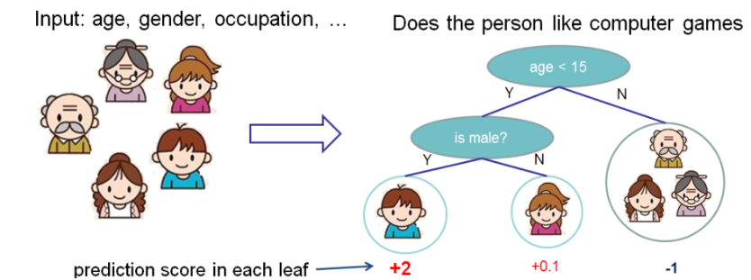

# 决策树集

在开始介绍树结构之前，我们先来学习XGBoost使用的决策树集。决策树集是由一组分类回归树（classification and regression tree, CART）构成的集合组成的。这里有一个使用CART的关于判断一个人是否喜欢电脑游戏的分类示例。

我们将家庭成员从两个层面进行划分，然后给他们的相关叶子节点打分。CART和其他两种决策树有一点不同，CART中只有叶子节点才有决策值。CART中真实的分数和每一个叶子几点相关联，他给了我们很多解释他的方法，可以用于分类。他还允许有原则的、同意的方法来进行优化。

通常情况下，在实践中，一棵树不够强壮。因此我们需要使用集合模型，他将多棵树的预测结果综合起来。

上边是将两棵树合并的示例，预测的分数是每一棵数各自的分数相加的结果。如果你仔细观察这个示例，你会发下两棵树是进行相互补充的。这个模型的数学形式为：
$$\hat y_i=\sum_{k=1}^K f_k(x_i), f_k \in \mathcal{F}$$
其中$K$是tree的数量，$f$属于函数空间$\mathcal{F}$，而$\mathcal{F}$是一个所有可能的CART的集合。我们需要优化的目标函数是：
$$obj(\theta)=\sum_i^n l(y_i, \hat y_i)+\sum_{k=1}^K \Omega(f_k)$$

那么现在有一个问题，Random Forest使用的是什么模型：也是数集。因此random forest和boosted tree实际上是相同的模型。不同的地方在于我们如何去训练他们。这就意味着如果你要实现一个tree ensembles的预测服务，你需要做的事情就是实现一个模型，它既可以用于随机森林，也可以用于提升树。