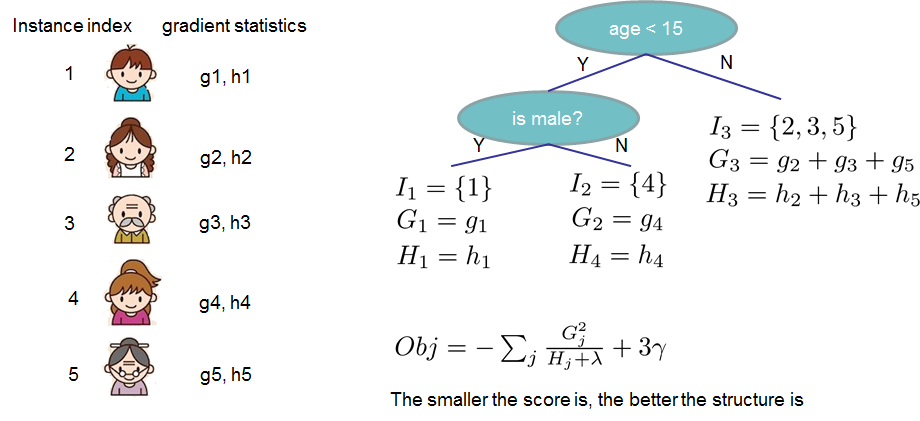
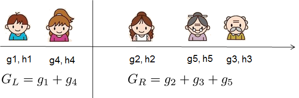

# Tree Boosting

我们应该如何学习到这个树集？答案和所有的监督学习一样：定义一个目标函数然后优化它！

上一节我们介绍了他的目标函数：

$$obj(\theta)=\sum_i^n l(y_i, \hat y_i^{(t)})+\sum_{i=1}^t \Omega(f_i)$$

## 增加式训练

首先我们要考虑的问题是：这些tree的参数是什么。我们可以发现我们需要学习的是那些函数$f_i$，每一个都包含了一个树结构和叶子分数。学习树结构比传统的优化问题要难很多，传统的优化问题可以简单的使用梯度。我们很难一次性的学习所有的树，所以我们采用一种增加式的策略：补充（修复）我们已经学习到的东西，并且一次只添加一颗新树。我们将第$t$步的预测值写为$\hat{y_i}^{t}$，因此我们可以得到：

$$\begin{aligned}
\hat{y_i}^{(0)} &= 0 \\
\hat{y_i}^{(1)} &= f_1(x_i)=\hat{y_i}^{(0)}+f_1(x_i) \\
\hat{y_i}^{(2)} &= f_1(x_i)+f_2(x_i)=\hat{y_i}^{(1)}+f_2(x_i) \\
\cdots \\
\hat{y_i}^{(t)} &=\sum_{k=1}^t f_k(x_i)=\hat{y_i}^{(t-1)}+f_t(x_i) 
\end{aligned}
$$

那么现在就有了第二个问题：在每一步中，我们需要一颗什么样的树呢？本质上来说我们需要添加一颗树来优化我们的目标函数。
$$
\begin{aligned}
obj^{(t)} & = \sum_{i=1}^n l(y_i, \hat{y_i}^{(t)}) + \sum_{i=1}^t \Omega(f_i) \\
& = \sum_{i=1}^n l[y_i, \hat{y_i}^{(t-1)}+f_t(x_i)]+\Omega(f_t)+constant
\end{aligned}
$$

如果我们使用均方误差作为损失函数，则目标函数就变为：
$$\begin{aligned}
obj^{(t)} &= \sum_{i=1}^n (y_i-(\hat{y_i}^{(t-1)}+f_t(x_i)))^2+\sum_{i=1}^t \Omega(f_i) \\
&= \sum_{i=1}^n [2(\hat{y_i}^{(t-1)}-y_i)f_t(x_i) + f_t(x_i)^2]+ \Omega(f_t)+constant
\end{aligned}$$

MSE的形式对我们很友好，他有一阶项（有时在这也称为余项），还有一个二次项。一般情况下，我们将目标函数进行泰勒展开来获得二阶项。

$$obj^(t)=\sum_{i=1}^n[l(y_i, \hat{y_i}^{(t-1)})+g_if_t(x_i)+\frac{1}{2}h_if^2_t(x_i)]+\Omega(f_t)+constant$$

其中$g_i$和$h_i$的定义为：

$$
\begin{aligned}
g_i &= \frac{\partial l(y_i, \hat{y_i}^{(t-1)})}{\partial \hat{y_i}^{(t-1)}} \\
h_i &= \frac{\partial^2 l(y_i, \hat{y_i}^{(t-1)})}{\partial (\hat{y}^{(t-1)})^2}
\end{aligned}$$

在移除掉常数项之后，步骤t的目标函数就变为：
$$\sum_{i=1}^n [g_if_t(x_i)+\frac{1}{2}h_if_t^2(x_i)]+\Omega(f_t)$$

这就是我们需要为新的tree优化的目标，这个目标函数的定义的重要有点事目标函数的值仅依赖于$g_i$和$f_i$，这使得XGBoost可以支持用户自定义损失函数。我们可以优化任何一个损失函数，包括逻辑回归和pairwise ranking，只要提供相对应的$g_i$和$h_i$作为输入。

## 模型复杂度

我们介绍了训练的步骤，但是还需要一个重要的事情，就是正则项。我们需要定义一个树$\Omega(f)$的复杂度，为了达到这个目的我们改善一下树$f(x)$的定义为：
$$f_t(x)=\omega_{q(x)}, \omega \in \mathbb{R}^T,q: \mathbb{R}^d \to \{1,2,\cdots,T\}$$

其中$\omega$是叶子上分数的向量，而$q$是一个将每一个点映射到相关叶子上的函数，而$T$是叶子的数量，在XGBoost中，我们将复杂度定义为：
$$\Omega(f)=\gamma T+\frac{1}{2}\lambda\sum_{j=1}^T \omega_j^2$$

实质上有很多种方法来定义复杂度，但是上面的定义方式在我们实际运用中的表现很好。有很多tree package的框架中，对正则项的处理不够小心，有的甚至直接忽略掉它，这是因为传统对待tree学习的方法只着重提升不纯度，而将复杂度的控制交给了启发式算法。我们通过对复杂度进行正式的定义，可以对于我们学习到的是什么以及观察到的模型有更好的认知。

## 结构分

在对树模型进行重新公式化之后，我们可以将第t颗树的目标值写为：

$$\begin{aligned}
obj^{(t)} &\approx \sum_{i=1}^n [g_i\omega_{q(x_i)}+\frac{1}{2}h_i\omega^2_{q(x_i)}]+\gamma T+\frac{1}{2}\lambda\sum_{j=1}^T \omega_j^2\\
&=\sum_{j=1}^T[(\sum_{i \in I_j}g_i)\omega_j+\frac{1}{2}(\sum_{i \in I_j} h_i + \lambda)\omega_j^2]+\gamma T
\end{aligned}$$

其中$I_j={i|q(x_i)=j}$，$I_j$是映射到第j个叶子的数据点索引的集合。注意到上式中的第二行，我们将索引的总和进行了改变，这是因为映射到相同叶子的数据将获得相同的分数，我们可以通过定义$G_i=\sum_{i\in I_j}g_i$和$H_j=\sum_{i\in I_j}h_i$来对上式进一步的压缩：
$$obj(t)=\sum_{j=1}^T[G_j\omega_j+\frac{1}{2}(H_j+\lambda)\omega^2]+\gamma T$$

在上边的式子中$\omega_j$与其他项无关，而$G_j\omega_j+\frac{1}{2}(H_j+\lambda)\omega_j^2$是一个二次项，并且对于给定的结构$q(x)$，最好的$\omega_j$是：
$$\omega_j^*=-\frac{G_j}{H_j+\lambda}$$
而最佳的目标函数是：
$$obj^*=\frac{1}{2} \sum_{j=1}^T \frac{G_j^2}{H_j+\lambda}+\gamma T$$

上边这个公式是用来衡量tree结构$q(x)$的好坏程度的。

上边的公式理解起来可能有一点复杂，让我们看一看下边这张图。

对于一个给定的树形结构，我们给叶子节点它们对应的统计项$g_i$和$h_i$，并且将这些统计里加起来，然后用上边的公式来计算这棵树是否足够好。这个数值就类似于decision tree种的不纯度，不过它还考虑了模型的复杂度。

## 学习树结构

现在我们有方法来评判一棵树的好坏程度，理想的情况下我们应该美居所有可能得树然后选择最合适的那一个。但是实际中这显然不具备可操作性，因此我们选择尝试一次优化树的一层。具体来说，我们选择将一个叶子划分为两个叶子，并且它的得分增长为：

$$Gain=\frac{1}{2}[\frac{G^2_L}{H_L+\lambda}+\frac{G^2_R}{H_R+\lambda}-\frac{(G_L+G_R)^2}{H_L+H_R+\lambda}]-\gamma$$

上边的式子可以被分解成四部分：

1. 左边叶子的得分
2. 右边叶子的得分
3. 原始叶子的得分
4. 新增加叶子的正则项

我们可以发现一个重要的问题，如果gain比$\gamma$小怎么办？纳闷我们最好不要增加这个分支。这实际上是tree-based模型的**剪枝**。

对于实数值来说，我们通常会搜索寻找一个最佳的切分点，为了有效的寻找切分点，我们对所有的实例进行排序，就像下边这幅图一样：

从左到右的扫描可以有效的计算所有可能划分方案的结构得分，因此我们可以有效的找到最佳的划分点。

## Final words On XGBoost

现在你应该能够理解什么是boosted trees。实际上XGBoost就是完全遵循这篇文章介绍的准则的一个工具。更加重要的是，在开发XGBoost的过程中，我们对system optimization和机器学习准则有更深层的考虑。这个库会更加极致的使用机器的算力来提供一个可扩展的、简便的、精准的库。