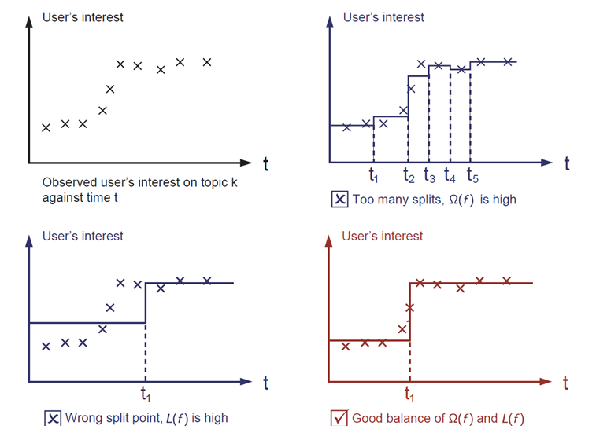

# Elements of Supervised Learning

XGBoost用于监督学习问题，也就是使用训练数据（拥有多特征）$x_i$来预测目标变量$y_i$。在我们学习特定的树之前，先来复习一下监督学习的基本元素。

## 模型和参数

监督学习中的**模型**通常是指一种根据输入$x_i$来预测输出$y_i$的数学结构。一个最常见的例子就是线性模型，我们通过$\hat y_i=\sum_j \theta_j x_{ij}$来给出预测，也就是将输入的特征根据不同权重进行线性组合。预测输出的值根据不同的任务（回归和分类）有不同的解释。例如说在逻辑回归中通过逻辑变换来得到正类（positive class）的概率，又或者再对输出进行排名时输出作为排名得分。

参数（parameters）是需要我们从数据学习到的内容。在线性回归问题中，参数就是系数$\theta$。

## Objective Function: Training Loss + Regularization

通过更好的选择$y_i$，我们表达大量的任务，例如说回归、分类以及排名。对模型的训练任务相当于找到最佳的参数$\theta$来匹配训练数据$x_i$和标签$y_i$。为了训练数据，我们需要定义一个目标函数来衡量模型对训练数据的匹配程度。目标函数主要由两部分内容构成：训练损失（Training Loss）和正则项（Regularization Term）:
$$obj(\theta) = L(\theta) + \Omega(\theta)$$

其中**$L$**是训练损失函数，**$\Omega$**是正则项。训练损失是用来衡量模型的预测与训练数据偏差。**$L$**的一个简单选择是均方误差（*mean squared error*）：
$$L(\theta)=\sum_i (y_i-\hat y_i)^2$$
还有一个常见的逻辑损失的损失函数，常用于逻辑回归：
$$L(\theta)=\sum_i[y_i ln(1+e^{-\hat y_i}) + (1-y_i) ln(1+e^{\hat y_i})]$$
人们常常忘记添加正则项。正则项适用于控制模型的复杂程度的（防止过拟合）。这听起来可能有一些抽象，让我们来看下边的这几幅图。我们的任务是来fit一个外表是阶梯状的函数，下边三个个不同的方案，你觉得哪一个最合适？

右下角这幅图是最合适的。一个基本原则是，我们需要一个即简单又具有预测性（正确率高）的模型。在这两者之间的权衡在机器学习中被称为bias-variance tradeoff（偏差-方差权衡）。